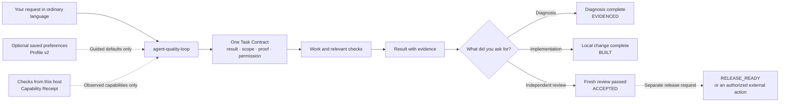

# Agent Quality Loop

[](https://github.com/MQZZang/agent-quality-loop/actions/workflows/validate.yml)

**Agent Quality Loop (AQL) 3.1.0** is a portable Skill for work where “done” needs to mean more than an agent saying it is done. You describe the job in ordinary language. AQL turns it into one Task Contract: what result you want, what may change, what evidence will count, and how far the agent may act.

AQL is not another IDE or hosted service, and it does not publish anything on its own. The main workflow works without Profile v2, the optional CLI, Cursor hooks, or access to your user directory.

中文速览：[AQL 3.1 快速开始](docs/quickstart.zh-CN.md)。The exact implementation rules are the [3.0 product and execution contract](docs/aql-3.0-product-contract.md) as amended by the 3.1.0 entries in [CHANGELOG.md](CHANGELOG.md); where a document and the shipped bytes disagree, the Skill source under `.cursor/skills/agent-quality-loop/` is authoritative.

| Where this repository stands | Status |
|---|---|
| Source package version | `3.1.0` |
| Product surface | One Skill: `agent-quality-loop` |
| Contract for each task | One Task Contract |
| GitHub release | Created only after an exact `v3.1.0` tag passes the release workflow |
| License | MIT |

> **Before you install:** the AQL 3.1 source candidate lives on the `aql-3.1-candidate` branch and the `v3.1.0` tag. Check out the tag when you need an immutable artifact; use a branch when you are evaluating or developing.

## Why AQL exists

Getting an answer or patch from an agent is easy. The harder part is deciding whether it solved the right problem, whether the checks support its claim, and whether a local change is about to turn into an action you never approved.

AQL keeps those decisions visible without asking you to fill out a form:

- **You can see what “done” means.** Before substantial work, the agent states the result, the edit boundary, and the most likely misunderstanding.
- **The plan starts from the real project.** Files, behavior, and key assumptions are checked before the agent commits to a plan. If the request rests on a false premise, you hear that first.
- **Each claim has matching evidence.** A test, receipt, or review proves only what it actually checked.
- **You get the result before the process details.** Routine replies lead with the outcome, the important evidence, and anything you still need to do.
- **You stay in control of external actions.** “Be thorough” does not mean “push this,” and an accepted change is not automatically a released change.

## How it works



Saved preferences and host checks can add useful context to the same Task Contract. They cannot rewrite your request, weaken the checks, approve the result, or give the agent more permission.

For example, this request should lead to a boundary this clear before the work begins:

```text
You: Fix the local timeout and verify it. Do not deploy.
AQL goal: The timeout failure is fixed and repeatable checks pass.
Working boundary: Local files and tests only; no push, publish, or deploy.
First thing to confirm: Which timeout setting actually controls runtime behavior?
Stopping point: BUILT after local checks. Independent review was not requested.
```

### Know where the work stopped

| State | What it means | What it does not mean |
|---|---|---|
| `EVIDENCED` | You asked for a diagnosis or evidence review, and that work is complete. | No implementation is implied. |
| `BUILT` | The local change is complete and the implementer’s own checks passed. | It has not passed an independent review and is not ready to release. |
| `ACCEPTED` | A separate, fresh review checked the frozen result against every required acceptance item. | There is still no permission to push, tag, publish, or deploy. |
| `RELEASE_READY` | The accepted result passed a separate, read-only release preflight. | Nothing has changed on the external target. |
| `DEPLOYED` | The named external target changed after you authorized that exact action in the current request. | The real-world outcome has not yet been proven. |
| `PRODUCTION_VERIFIED` | The required outcome was checked on the real target after deployment. | The claim goes no further than the named target and checks. |

## When it fits

**Use AQL for:** long or ambiguous tasks, root-cause diagnosis, local work that must not be deployed, writing with clear source boundaries, independent review, resumable work, and release preparation where you want to keep final control.

**Do not use AQL for:** one-line facts or casual brainstorming. It also does not replace domain judgment, prove that a product is valuable, learn silently from repeated behavior, sandbox shell commands, or provide standing permission for external actions.

## Start in 60 seconds

The main workflow runs from the Skill instructions and starts no background service. You need Node.js to use the installer, optional Profile and Receipt commands, conformance checker, and maintainer checks. CI currently tests with Node.js 22, so that is the recommended version.

```bash
git clone https://github.com/MQZZang/agent-quality-loop.git
cd agent-quality-loop
git checkout v3.1.0   # or stay on a branch to evaluate the source candidate
node --version
node scripts/install.js install --to cursor --dry-run
node scripts/install.js install --to cursor
```

Replace `cursor` with the host you actually use. Choose `all` only when you really want three separate copies. `--dry-run` shows the plan without changing files.

Choose the matching install target:

| `--to` value | Snapshot destination |
|---|---|
| `agents` | `~/.agents/skills/agent-quality-loop` |
| `cursor` | `~/.cursor/skills/agent-quality-loop` |
| `claude` | `~/.claude/skills/agent-quality-loop` |
| `both` | `agents` and `cursor` |
| `all` | `agents`, `cursor`, and `claude` |

The installer copies real files and records what it owns under `~/.aql/install-receipts/`. It will not replace a directory it does not own. If an installed file has changed, update and uninstall stop so you can inspect it first. Your Profile data and project identity are never part of the installed files it owns.

```bash
node scripts/install.js status --to cursor
node scripts/install.js update --to cursor --dry-run
node scripts/install.js uninstall --to cursor --dry-run
```

AQL does not provide an `npx aql` command. In the examples below, `<SKILL_ROOT>` is the installed `agent-quality-loop` directory:

```bash
node <SKILL_ROOT>/scripts/aql.js --help
node <SKILL_ROOT>/scripts/conformance.js --self-test
```

Then ask in ordinary language. For example:

```text
Diagnose the root cause only. Do not change files.
Fix this locally, run the relevant checks, and do not publish.
Independently accept the current implementation against its original goal.
Prepare a release preflight, but do not push or create a Release.
```

Ordinary language is the main interface. If your host lets you select a Skill, choose `agent-quality-loop`. No host-specific slash command is required.

### Make sure your host can see the Skill

`status` confirms that the installed copy exists and still matches the installer’s record. It cannot confirm that a running host loaded the Skill. After installation:

1. run `node scripts/install.js status --to <your-target>` and require `OWNED ... @3.1.0`;
2. start or reload the target host and use its Skill discovery view to find `agent-quality-loop`;
3. ask a small read-only task and confirm the result preserves the requested boundary.

If status reports `UNOWNED` or drift, inspect the target before you update or uninstall it. Copied files alone do not prove that every host loaded and used the Skill correctly.

## Optional Profile v2

Profile v2 lets you save a small number of preferences you explicitly choose. It does not watch how you work or learn from repetition. Its default policy is `explicit_only`:

- repeating the same choice does not create or save anything;
- a clear “remember this” instruction can be saved, while unclear or sensitive preferences require confirmation;
- a new Profile starts disabled and affects work only after you enable it;
- your current request always wins, and Fresh Mode ignores saved preferences for one task;
- at most two relevant, source-linked preferences may guide a task;
- nothing syncs or uploads in the background, and there is no daemon or cloud account.

The optional CLI lets you create, inspect, use, and remove these preferences. Revision checks prevent one command from silently overwriting a newer change:

```bash
node <SKILL_ROOT>/scripts/aql.js profile init --profile ./profile.json
node <SKILL_ROOT>/scripts/aql.js profile remember --profile ./profile.json --id concise --key result.concise --kind communication --value-text concise --applies-when "the task needs a result" --reference "task:instruction"
node <SKILL_ROOT>/scripts/aql.js profile enable --profile ./profile.json --expected-revision 1
node <SKILL_ROOT>/scripts/aql.js profile show --profile ./profile.json
node <SKILL_ROOT>/scripts/aql.js profile project --profile ./profile.json --context ./projection-context.json
node <SKILL_ROOT>/scripts/aql.js profile export --profile ./profile.json --out ./profile-export.json
node <SKILL_ROOT>/scripts/aql.js profile import --profile ./profile.json --in ./profile-export.json --dry-run
node <SKILL_ROOT>/scripts/aql.js receipt --profile ./profile.json
node <SKILL_ROOT>/scripts/aql.js profile forget --profile ./profile.json --id concise --expected-revision 2
```

If a preference needs confirmation, use `propose` and then `confirm --confirmation-ref ...`. Moving a Profile to another machine is always an explicit export/import. `profile project` reads a task-local `projection-context.json`: the [projection context rules](.cursor/skills/agent-quality-loop/references/profile-projection.md#cli-projection-context) define its fields and the [Chinese quickstart](docs/quickstart.zh-CN.md) has a minimal example.

## Capability Receipt and conformance

A Capability Receipt answers a narrow question: what could this host or probe actually observe right now? Each entry is `observed_true`, `observed_false`, or `not_run`, and records where the observation came from. A Receipt cannot prove a task result, report a model’s opinion about itself, or give the agent permission.

```bash
node <SKILL_ROOT>/scripts/aql.js receipt --help
node <SKILL_ROOT>/scripts/aql.js receipt --profile ./profile.json
```

The bundled conformance runner checks a bundle’s structure offline. Passing it does not mean the work itself has passed an independent review:

```bash
node <SKILL_ROOT>/scripts/conformance.js --self-test
node <SKILL_ROOT>/scripts/conformance.js ./conformance-bundle.json
```

Optional [Cursor hooks](integrations/cursor-hooks/README.md) handle only rules a script can decide, such as refusing to auto-allow a matched external-write command. They are an extra guardrail, not a sandbox or an independent review.

## What the current evidence supports

The [21 evaluation cases](.cursor/skills/agent-quality-loop/references/evaluation-cases.md) and automated suites check specific AQL mechanics. They do not show that AQL improves a product or a person over time.

| Adoption question | Current evidence boundary |
|---|---|
| Is the single-Skill package internally consistent? | Static checks, matching manifests, installer/runtime self-tests, and offline conformance cover the mechanics they name. |
| Are the Task Contract, Profile v2, and Receipt boundaries implemented? | The specification and repeatable tests cover those boundaries. This says nothing about product benefit. |
| Will every listed host load and behave identically? | The package layouts pass validation. Live behavior still has to be checked in each host. |
| Were the 3.1 behavior changes checked by running them? | Yes, on one model and host pair (`cursor-grok-4.5-high-fast`). Skill trigger and silence gates passed 8/8 and 8/8, and the candidate-acceptance gate passed its seven conditions under blind grading. See the [3.1 acceptance record](docs/aql-3.1-acceptance-record.md). |
| Does the full Skill beat a minimal kernel? | Not shown. The ablation returned `NO_LARGE_EFFECT_DETECTED` on goal correctness at n=6 per arm; only hard-gate-adjacent qualitative differences favored the Skill arms. |
| Is AQL 3.0 better than 2.8, or is Profile v2 product-effective? | Both preregistered screenings remain `NOT_RUN`. |
| Did the historical Profile v1 experiment prove value? | No. Its mechanism evidence is historical and its A/B/C value control is `INVALID`. |
| Does AQL prove long-term user or productivity improvement? | No. Longitudinal and causal claims remain `NOT_RUN`. |

See the [claim evidence matrix](docs/claim-evidence-matrix.md) and [3.0 screening preregistration](docs/aql-3.0-product-screening-preregistration.md) for the full record. Missing evidence stays `NOT_RUN`; it is never presented as PASS.

## Version and release model

`manifest.json`, the Skill metadata, and `plugin.json` agree on version `3.1.0`, and [CHANGELOG.md](CHANGELOG.md) dates that entry. A GitHub Release still exists only after the exact `v3.1.0` tag passes the release workflow.

- Pushes to `master` and pull requests run `node scripts/validate-all.js` on Ubuntu, Windows, and macOS.
- Creating `v3.1.0` is a separate release action. The release workflow checks the exact tagged commit on all three platforms, confirms that every version marker points to the same commit, generates an attestation, and only then creates a GitHub Release.
- Passing local checks or an independent review does not publish a release.

## Repository map

| Path | Role |
|---|---|
| `.cursor/skills/agent-quality-loop/` | Canonical Skill source. Edit here. |
| `.agents/skills/` | Generated generic-agent snapshot. |
| `skills/` | Generated Agent Plugins package snapshot. |
| `.cursor/rules/` | Cursor routing and minimal project guardrails. |
| `.ai/` | Project lessons and knowledge used during maintenance. |
| `.github/` | Validation and exact-tag release workflows. |
| `docs/` | Guide, quickstart, product contract, claim ledger, preregistered protocols, and the 3.1 experiment records. |
| `integrations/` | Optional host integrations; currently the Cursor hooks add-on. |
| `probes/` | Historical probe fixtures and transcripts, not installation payload. |
| `scripts/` | Installer, synchronization, CLI wrappers, validation, packaging, and release tooling. |
| `AGENTS.md` | Repository architecture and editing rules. |
| `CHANGELOG.md` | Package history and unreleased changes. |
| `CONTRIBUTING.md` | Contribution workflow and release boundary. |
| `MATRIX.md` | Capability qualification rows (model × host × task class × assurance) plus the historical probe archive. |
| `plugin.json` | Agent Plugins metadata. |
| `README.md`, `LICENSE`, `.gitattributes`, `.gitignore` | Public entry, license, and repository metadata. |

## Maintainer verification

Edit the canonical Skill tree, regenerate the two copies, and then validate:

```bash
node scripts/sync-skills.js
node scripts/sync-skills.js --check
node scripts/validate-all.js
git diff --check
```

`sync-skills.js --check` is read-only. These commands check repository mechanics; they do not approve the product or authorize a release. Contribution rules are in [CONTRIBUTING.md](CONTRIBUTING.md).

## Further reading

- [Day-to-day guide](docs/guide.md)
- [快速开始（中文）](docs/quickstart.zh-CN.md)
- [Claim evidence matrix](docs/claim-evidence-matrix.md)
- [Capability qualification matrix](MATRIX.md)
- [3.1 acceptance record](docs/aql-3.1-acceptance-record.md) and [3.1 execution report](docs/aql-3.1-execution-report.md)
- [Changelog](CHANGELOG.md)

## License

MIT. See [LICENSE](LICENSE).
